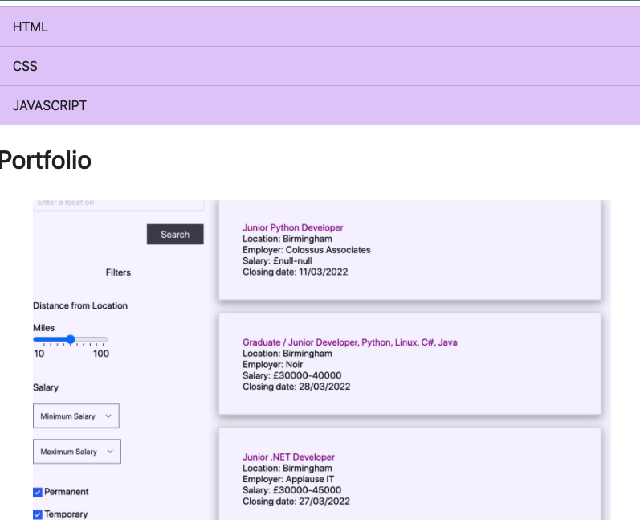

# Portfolio
Portfolio of applications created

Description:
A website that showcases the applications I have built, during my time on the bootcamp. Includes 5 projects, header with nav bar that links to sections of my work, short bio with picture, my email and other contact details. I styled the elements using CSS with code written in HTML. The page is mobile responsive and each image links to the corresponding application.

This application will be a work in progress, I will add more styling, additional links, updated applications and incorporate javascript to some elements.

Deployed application: https://misscbrown.github.io/Portfolio/

